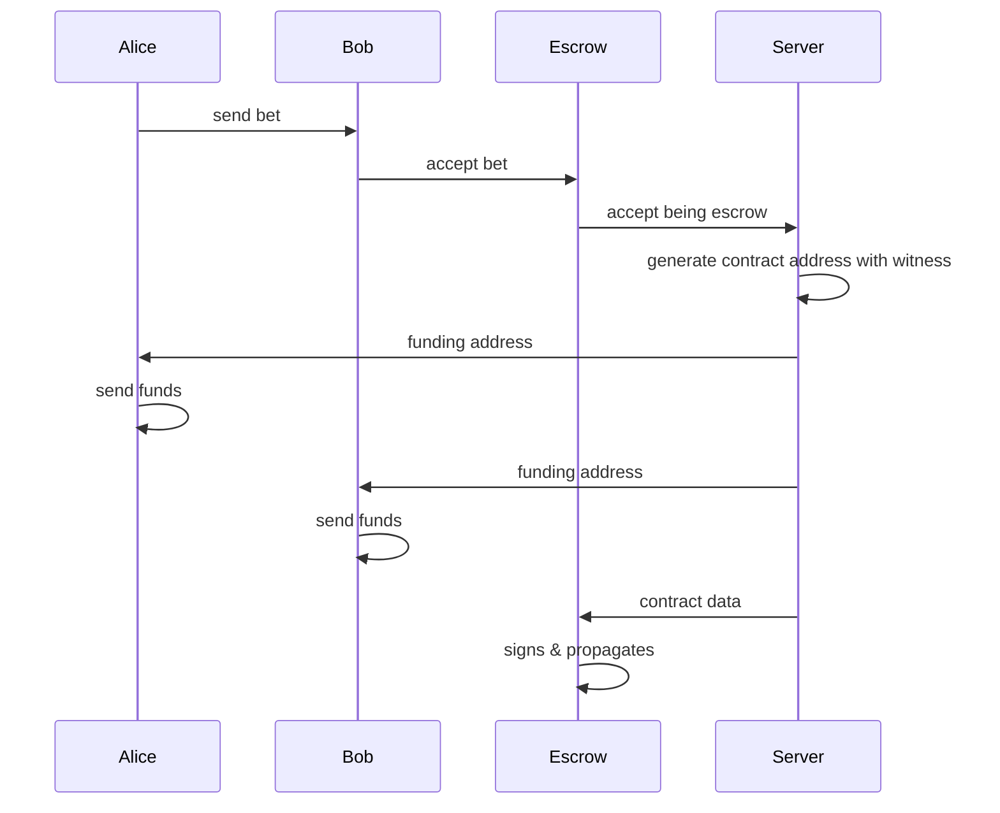

# Idea

This project is an implementation of an time-locked escrow solution that leverages
from nostr and simplicity capabilities.

# Use case
Suppose Alice and Bob want to bet on something, and they choose _something_
or _someone_ to be their Escrow. They'll use nostr to communicate and the bet
will be settled in the Liquid network via a simplicity contract.

# Sequence Diagram

Here every actor has a nostr client, and they're listening to events regarding
their possible actions.

With the proper tooling, the server would not be required and Escrow could
generate the address itself, propagate the message and sign the final transaction.
However, event with the server, parties can still verify if the contract and
address, since they only need to download to tools and check it on their side.

